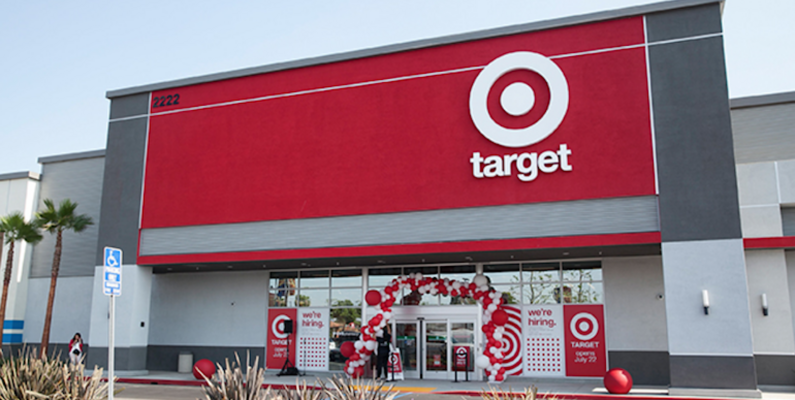

# 🛍️ Target E-commerce Data Analysis using SQL



## 📦 Dataset

This analysis is based on the [Target E-commerce Dataset on Kaggle](https://www.kaggle.com/datasets/devarajv88/target-dataset).  
It contains structured tables representing customers, orders, products, payments, and sellers.


## 📊 Overview

This project presents a structured analysis of the **Target E-commerce Dataset** using SQL. The dataset includes comprehensive customer, order, payment, and product information that allows in-depth business analysis such as sales trends, customer behavior, seller performance, and revenue growth.

This README outlines key business questions answered using SQL, categorized by difficulty level (Basic, Intermediate, and Advanced). The queries aim to extract valuable insights that can help stakeholders make informed decisions.

---

## 🎯 Objectives

- Understand customer distribution across states and cities.
- Analyze sales by product category and time.
- Track customer retention and behavior.
- Investigate seller revenue and product demand.
- Measure order growth, seasonality, and revenue trends.
- Practice and master SQL skills including:
  - Joins & Grouping
  - Subqueries
  - Window Functions
  - Common Table Expressions (CTEs)
  - Aggregation, Ranking, and Date Functions

---

## 🧱 SQL Schema Assumption

The project assumes the following tables exist in the `ecommerce` database:

- `customers(customer_id, customer_city, customer_state)`
- `orders(order_id, customer_id, order_purchase_timestamp)`
- `products(product_id, product category)`
- `order_items(order_id, product_id, seller_id, price)`
- `payments(order_id, payment_value, payment_installments)`

---


## 🧾 SQL Questions with Solutions

### 🟩 Basic Queries

#### 1. List all unique cities where customers are located.
```sql
SELECT DISTINCT customer_city FROM customers;
```
🎯 *Identify geographic diversity of customers.*

#### 2. Count the number of orders placed in 2017.
```sql
SELECT COUNT(order_id) FROM orders WHERE YEAR(order_purchase_timestamp) = 2017;
```
🎯 *Measure order volume for a specific year.*

#### 3. Find the total sales per category.
```sql
SELECT products.`product category` AS category, 
       ROUND(SUM(payments.payment_value), 2) AS sales 
FROM products 
JOIN order_items ON products.product_id = order_items.product_id 
JOIN payments ON payments.order_id = order_items.order_id
GROUP BY products.`product category`;
```
🎯 *Breakdown of revenue by product category.*

#### 4. Calculate the percentage of orders that were paid in installments.
```sql
SELECT (SUM(CASE WHEN payment_installments >= 1 THEN 1 ELSE 0 END) / COUNT(*)) * 100 AS percentage
FROM payments;
```
🎯 *Analyze payment behavior.*

#### 5. Count the number of customers from each state.
```sql
SELECT customer_state, COUNT(customer_id)
FROM customers 
GROUP BY customer_state;
```
🎯 *Distribution of customers by region.*

### 🟨 Intermediate Queries

#### 1. Calculate the number of orders per month in 2018.
```sql
SELECT MONTHNAME(order_purchase_timestamp) AS months, COUNT(order_id) AS order_counts
FROM orders 
WHERE YEAR(order_purchase_timestamp) = 2018
GROUP BY months;
```
🎯 *Seasonal analysis of sales.*

#### 2. Find the average number of products per order, grouped by customer city.
```sql
WITH count_per_order AS (
  SELECT orders.order_id, orders.customer_id, COUNT(order_items.order_id) AS oc
  FROM orders 
  JOIN order_items ON orders.order_id = order_items.order_id
  GROUP BY orders.order_id, orders.customer_id
)
SELECT customers.customer_city, ROUND(AVG(count_per_order.oc), 2) AS average_orders
FROM customers 
JOIN count_per_order ON customers.customer_id = count_per_order.customer_id
GROUP BY customers.customer_city 
ORDER BY average_orders DESC;
```
🎯 *Evaluate customer purchase behavior by city.*

#### 3. Calculate the percentage of total revenue contributed by each product category.
```sql
SELECT UPPER(products.`product category`) AS category, 
       ROUND((SUM(payments.payment_value) / (SELECT SUM(payment_value) FROM payments)) * 100, 2) AS sales_percentage
FROM products 
JOIN order_items ON products.product_id = order_items.product_id 
JOIN payments ON payments.order_id = order_items.order_id
GROUP BY products.`product category`
ORDER BY sales_percentage DESC;
```
🎯 *Understand top-performing product segments.*

#### 4. Identify correlation between product price and number of times a product was purchased.
```sql
SELECT products.`product category`,
       COUNT(order_items.product_id) AS purchase_count,
       ROUND(AVG(order_items.price), 2) AS avg_price
FROM products 
JOIN order_items ON products.product_id = order_items.product_id
GROUP BY products.`product category`;
```
🎯 *Examine product demand vs pricing.*

#### 5. Calculate total revenue per seller and rank them.
```sql
SELECT *, DENSE_RANK() OVER (ORDER BY revenue DESC) AS rn 
FROM (
  SELECT order_items.seller_id, SUM(payments.payment_value) AS revenue
  FROM order_items 
  JOIN payments ON order_items.order_id = payments.order_id
  GROUP BY order_items.seller_id
) AS a;
```
🎯 *Identify high-performing sellers.*

### 🟥 Advanced Queries

#### 1. Moving average of order values for each customer.
```sql
SELECT customer_id, order_purchase_timestamp, payment,
AVG(payment) OVER(PARTITION BY customer_id ORDER BY order_purchase_timestamp
ROWS BETWEEN 2 PRECEDING AND CURRENT ROW) AS mov_avg
FROM (
  SELECT orders.customer_id, orders.order_purchase_timestamp,
  payments.payment_value AS payment
  FROM payments 
  JOIN orders ON payments.order_id = orders.order_id
) AS a;
```
🎯 *Smooth out order values to observe spending trends.*

#### 2. Cumulative sales per month for each year.
```sql
SELECT years, months, payment, 
SUM(payment) OVER(ORDER BY years, months) AS cumulative_sales
FROM (
  SELECT YEAR(orders.order_purchase_timestamp) AS years,
         MONTH(orders.order_purchase_timestamp) AS months,
         ROUND(SUM(payments.payment_value), 2) AS payment 
  FROM orders 
  JOIN payments ON orders.order_id = payments.order_id
  GROUP BY years, months 
  ORDER BY years, months
) AS a;
```
🎯 *Monitor revenue buildup over time.*

#### 3. Year-over-year growth rate of total sales.
```sql
WITH a AS (
  SELECT YEAR(orders.order_purchase_timestamp) AS years,
         ROUND(SUM(payments.payment_value), 2) AS payment 
  FROM orders 
  JOIN payments ON orders.order_id = payments.order_id
  GROUP BY years
)
SELECT years, payment, LAG(payment) OVER(ORDER BY years) AS previous_year,
((payment - LAG(payment) OVER(ORDER BY years)) / LAG(payment) OVER(ORDER BY years)) * 100 AS yoy_percentage_growth
FROM a;
```
🎯 *Track business growth annually.*

#### 4. Customer retention rate (within 6 months of 1st purchase).
```sql
WITH a AS (
  SELECT customers.customer_id,
         MIN(orders.order_purchase_timestamp) AS first_order
  FROM customers 
  JOIN orders ON customers.customer_id = orders.customer_id
  GROUP BY customers.customer_id
),
b AS (
  SELECT a.customer_id, COUNT(DISTINCT orders.order_purchase_timestamp) AS next_order
  FROM a 
  JOIN orders ON orders.customer_id = a.customer_id
              AND orders.order_purchase_timestamp > first_order
              AND orders.order_purchase_timestamp < DATE_ADD(first_order, INTERVAL 6 MONTH)
  GROUP BY a.customer_id
)
SELECT 100 * (COUNT(DISTINCT b.customer_id) / COUNT(DISTINCT a.customer_id)) AS retention_rate
FROM a 
LEFT JOIN b ON a.customer_id = b.customer_id;
```
🎯 *Understand customer loyalty and repeat behavior.*

#### 5. Top 3 customers by spending per year.
```sql
SELECT years, customer_id, payment, d_rank 
FROM (
  SELECT YEAR(orders.order_purchase_timestamp) AS years,
         orders.customer_id,
         SUM(payments.payment_value) AS payment,
         DENSE_RANK() OVER(PARTITION BY YEAR(orders.order_purchase_timestamp) 
         ORDER BY SUM(payments.payment_value) DESC) AS d_rank
  FROM orders 
  JOIN payments ON payments.order_id = orders.order_id
  GROUP BY YEAR(orders.order_purchase_timestamp), orders.customer_id
) AS a
WHERE d_rank <= 3;
```
🎯 *Identify VIP customers per year.*


---

## ✅ Conclusion

This SQL analysis explores several business dimensions — from customer geography and retention to revenue breakdowns and year-on-year growth. It also showcases a variety of SQL techniques valuable for any aspiring data analyst or business intelligence professional.

---

## 👨‍💻 Author

**Kaustav Roy Chowdhury**  
📧 Data Analyst | SQL Enthusiast | Python | Streamlit  
✍️ “In God we trust. All others must bring data.”  
